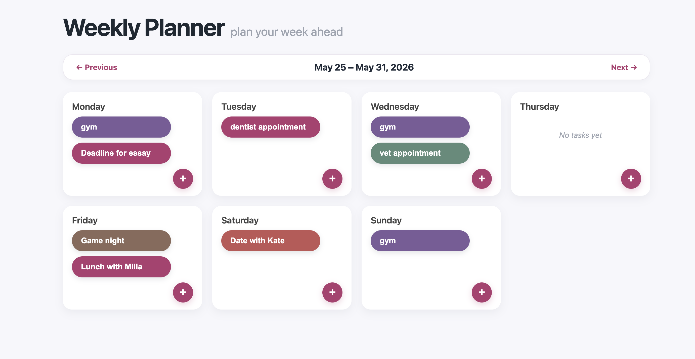
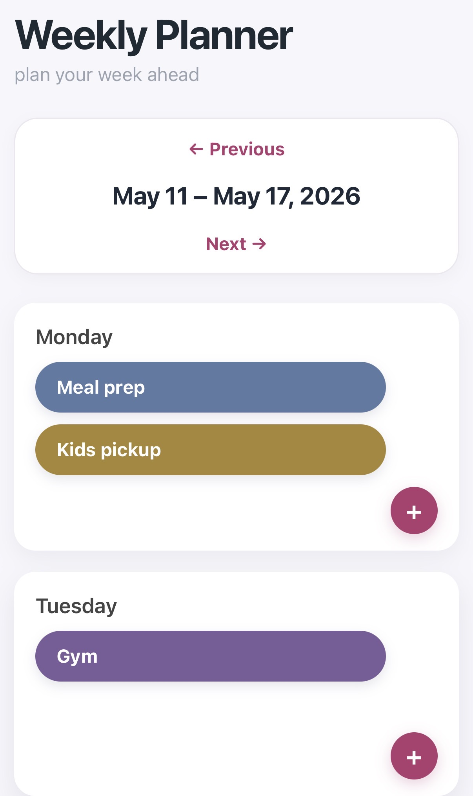

# Weekly Scheduler

A Flask + SQLite weekly planner app for creating tasks and assigning them to days of the week.

## Features
- Add and delete tasks
- Assign tasks to weekdays
- Navigate between weeks
- Color-coded task cards
- Responsive weekly layout

## Tech Stack
- Python
- Flask
- SQLite
- HTML/CSS
- JavaScript
- Gunicorn
- nginx

## What I practiced
- Flask app structure
- SQLite database handling
- Server-side routing and templates
- Deployment with gunicorn and nginx
- Debugging real deployment issues

## Deployment

The project is deployed on a Linux server using:

- Gunicorn
- nginx
- rsync deployment script

## Screenshots

### Desktop View

### Mobile View

## Status

This project is a work in progress. I’m actively improving the UI, deployment setup, and task management features.